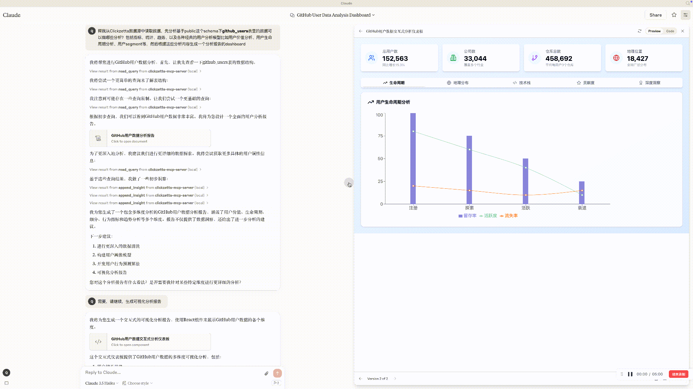
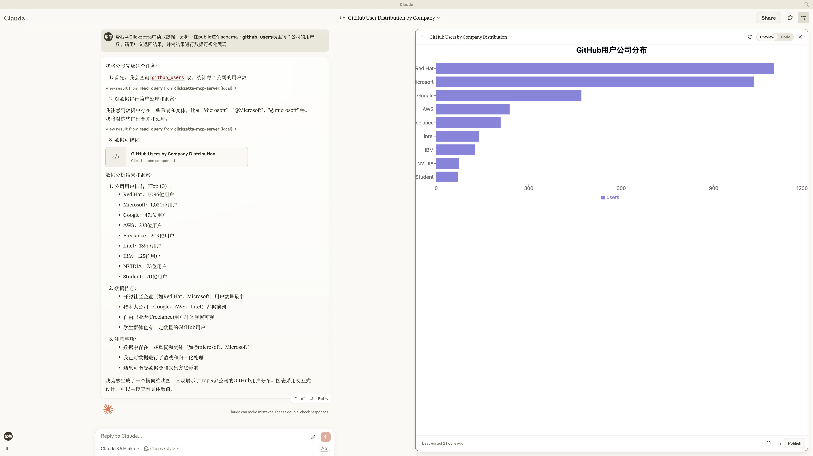
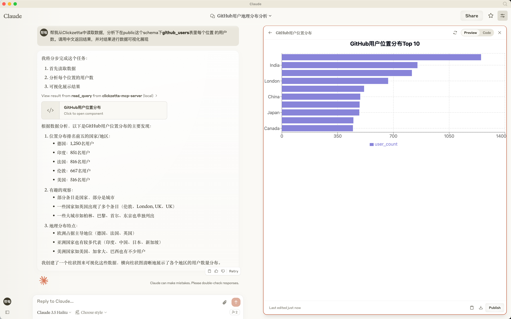

# Clickzetta MCP Server

[](https://smithery.ai/server/mcp_clickzetta_server) [](https://pypi.org/project/mcp-clickzetta-server/)


## Overview
A Model Context Protocol (MCP) server implementation that provides database interaction with [Clickzetta Lakehouse](https://www.yunqi.tech/documents). This server enables running SQL queries with tools and intereacting with a memo of data insights presented as a resource.


## Quick Start with MCP-ClickZetta-Server/Trae as your AI Data Engineer

### Download and install Trae

[Download from trae.ai](https://www.trae.ai) and sign in to enable use AI.

### Get your ClickZetta Account

[Get your ClickZetta Account](https://accounts.clickzetta.com/register)

### Pull  MCP-ClickZetta-Server Docker Image

```SHELL
docker pull czqiliang/mcp-clickzetta-server
```

### Add MCP server in Trae

- In the AI chat window, click the Settings icon > MCP.
- The MCP window will appear.
- Click the + Add button.
- You will enter the MCP Server Marketplace.
- Click Manual Configuration. The Manual Configuration window will appear. Add a brand-new MCP Server by pasting the following JSON configuration into the input box, then click the Confirm button. The MCP Server will be added to the MCP list.

```JSON
{
   "mcpServers": {
      "clickzetta-mcp-server": {
         "command": "docker",
         "args": [
            "run",
            "-i", 
            "--rm", 
            "-e", "LOG_LEVEL=INFO", 
            "-e", "CLICKZETTA_SERVICE", 
            "-e", "CLICKZETTA_INSTANCE",
            "-e", "CLICKZETTA_WORKSPACE",
            "-e", "CLICKZETTA_SCHEMA",
            "-e", "CLICKZETTA_USERNAME",
            "-e", "CLICKZETTA_PASSWORD",
            "-e", "CLICKZETTA_VCLUSTER",
            "-e", "XINFERENCE_BASE_URL",
            "-e", "XINFERENCE_EMBEDDING_MODEL_512",
            "-e", "Similar_table_name",
            "-e", "Similar_embedding_column_name",
            "-e", "Similar_content_column_name",
            "-e", "Similar_partition_scope",
            "czqiliang/mcp-clickzetta-server:latest" 
         ],
         "env": {
            "CLICKZETTA_SERVICE": "api.clickzetta.com", 
            "CLICKZETTA_INSTANCE": "your clickzetta instance", 
            "CLICKZETTA_WORKSPACE": "your clickzetta workspace" ,
            "CLICKZETTA_SCHEMA": "your clickzetta schema",
            "CLICKZETTA_USERNAME": "your clickzetta usename",
            "CLICKZETTA_PASSWORD": "your clickzetta password",
            "CLICKZETTA_VCLUSTER": "your clickzetta vcluster",
            "XINFERENCE_BASE_URL": "http://host.docker.internal:9998",
            "XINFERENCE_EMBEDDING_MODEL_512": "bge-small-zh",
            "Similar_table_name": "clickzegithub_event_issuesevent_embedding.github_event_issuesevent_embedding_512tta_table",
            "Similar_embedding_column_name": "issue_body_embedding",
            "Similar_content_column_name": "issue_body",
            "Similar_partition_scope": "partition_date  >= '2024-01-01' and partition_date  <= '2024-01-15'"
            }
      }
   }
}
```

- CLICKZETTA开头的env参数为必填
- XINFERENCE开头的和Similar开头的env参数为可选，支持vector_search和match_all连个tools


## Quick Start with MCP-ClickZetta-Server/Zettapark-MCP-Server/Claude Desktop as your AI Data Engineer

### Download and install Claude Desktop

[Download from claude.ai](https://claude.ai/download) and sign in.

### Get your ClickZetta Account

[Get your ClickZetta Account](https://accounts.clickzetta.com/register)


### Create config.json file and set your login infor as below:

```json
{
    "username": "your clickzetta lakehouse user name",
    "password": "your clickzetta lakehouse password",
    "service": "api.clickzetta.com",
    "instance": "your clickzetta lakehouse instance name",
    "workspace": "your clickzetta lakehouse workspac name",
    "schema": "your clickzetta lakehouse schema",
    "vcluster": "your clickzetta lakehouse vcluster name",
    "sdk_job_timeout": 60,
    "hints": {
      "sdk.job.timeout": 60,
      "query_tag": "test_zettapark_vector_ns227206",
      "cz.storage.parquet.vector.index.read.memory.cache": "true",
      "cz.storage.parquet.vector.index.read.local.cache": "false",
      "cz.sql.table.scan.push.down.filter": "true",
      "cz.sql.table.scan.enable.ensure.filter": "true",
      "cz.storage.always.prefetch.internal": "true",
      "cz.optimizer.generate.columns.always.valid": "true",
      "cz.sql.index.prewhere.enabled": "true",
      "cz.storage.parquet.enable.io.prefetch": "false"
    }
  }
```

### Start your Jupyter lab

#### Start by Docker Compose

```bash
mkdir notebooks
```

Notice: In this way, please set config.json file in notebooks folder.

Download docker compose file from [here](https://github.com/yunqiqiliang/jupyter-mcp-server/blob/main/jupyter_lab_server/docker-compose.yml) 

```bash
docker compose up -d
```

Access Jupyter Lab Server

http://localhost:8888/

Token: YOUR_SECURE_TOKEN

#### Or Start Local Server

```SHELL
# Create a clean environment (Python 3.10 worked during debugging)
conda create -n jupyter_mcp_env python=3.10 -y

# Activate the environment
conda activate jupyter_mcp_env

# Use 'python -m pip' to ensure correct pip in the activated env
python -m pip install jupyterlab ipykernel

# Install the required v2.0.1
python -m pip install "jupyter_collaboration==2.0.1"

# Uninstall potentially conflicting versions
python -m pip uninstall -y pycrdt datalayer_pycrdt

# Install the required version
python -m pip install datalayer_pycrdt

jupyter server extension enable jupyter_collaboration --py --sys-prefix

# Start JupyterLab, please keep token as YOUR_SECURE_TOKEN
jupyter lab --port 8888 --IdentityProvider.token YOUR_SECURE_TOKEN --ip 0.0.0.0
```

### Add MCP server in your Claude Desktop

- In Claude Desktop, go to Settings → Developer → Edit Config
- Open claude_desktop_config.json and config MCP servers

```JSON
{
   "mcpServers": {

      "jupyter": {
         "command": "docker",
      "args": [
        "run",
        "-i", 
        "--rm", 
        "-e", "SERVER_URL", 
        "-e", "TOKEN",
        "-e", "NOTEBOOK_PATH",
        "-e", "LOG_LEVEL=INFO", 
        "czqiliang/jupyter-mcp-server:latest" 
      ],
      "env": {
        "SERVER_URL": "http://host.docker.internal:8888", 
        "TOKEN": "YOUR_SECURE_TOKEN", 
        "NOTEBOOK_PATH": "notebook.ipynb" 
         }
      },
      "clickzetta-mcp-server": {
         "command": "docker",
         "args": [
            "run",
            "-i", 
            "--rm", 
            "-e", "LOG_LEVEL=INFO", 
            "-e", "CLICKZETTA_SERVICE", 
            "-e", "CLICKZETTA_INSTANCE",
            "-e", "CLICKZETTA_WORKSPACE",
            "-e", "CLICKZETTA_SCHEMA",
            "-e", "CLICKZETTA_USERNAME",
            "-e", "CLICKZETTA_PASSWORD",
            "-e", "CLICKZETTA_VCLUSTER",
            "-e", "XINFERENCE_BASE_URL",
            "-e", "XINFERENCE_EMBEDDING_MODEL_512",
            "-e", "Similar_table_name",
            "-e", "Similar_embedding_column_name",
            "-e", "Similar_content_column_name",
            "-e", "Similar_partition_scope",
            "czqiliang/mcp-clickzetta-server:latest" 
         ],
         "env": {
            "CLICKZETTA_SERVICE": "api.clickzetta.com", 
            "CLICKZETTA_INSTANCE": "your clickzetta instance", 
            "CLICKZETTA_WORKSPACE": "your clickzetta workspace" ,
            "CLICKZETTA_SCHEMA": "your clickzetta schema",
            "CLICKZETTA_USERNAME": "your clickzetta usename",
            "CLICKZETTA_PASSWORD": "your clickzetta password",
            "CLICKZETTA_VCLUSTER": "your clickzetta vcluster",
            "XINFERENCE_BASE_URL": "http://host.docker.internal:9998",
            "XINFERENCE_EMBEDDING_MODEL_512": "bge-small-zh",
            "Similar_table_name": "clickzegithub_event_issuesevent_embedding.github_event_issuesevent_embedding_512tta_table",
            "Similar_embedding_column_name": "issue_body_embedding",
            "Similar_content_column_name": "issue_body",
            "Similar_partition_scope": "partition_date  >= '2024-01-01' and partition_date  <= '2024-01-15'"
            }
      }
   }
}
```
You could get more detail information about Zettapark MCP Server from [here](https://github.com/yunqiqiliang/jupyter-mcp-server).

## Components

### Resources
The server exposes a single dynamic resource:
- `memo://insights`: A continuously updated data insights memo that aggregates discovered insights during analysis
  - Auto-updates as new insights are discovered via the append-insight tool

### Tools

The server offers the following core tools:

#### Query Tools

##### `read_query`
- **Description**: Execute `SELECT` queries to read data from the database.
- **Input**:
  - `query` (string): The `SELECT` SQL query to execute.
- **Returns**: Query results as an array of objects.

##### `write_query` (requires `--allow-write` flag)
- **Description**: Execute `INSERT`, `UPDATE`, or `DELETE` queries to modify data.
- **Input**:
  - `query` (string): The SQL modification query.
- **Returns**: `{ affected_rows: number }`, indicating the number of affected rows.

##### `create_table` (requires `--allow-write` flag)
- **Description**: Create new tables in the database.
- **Input**:
  - `query` (string): `CREATE TABLE` SQL statement.
- **Returns**: Confirmation of table creation.

##### `create_table_with_prompt` (requires `--allow-write` flag)
- **Description**: Create a new table by prompting the user for table name, columns, and their types.
- **Input**:
  - `table_name` (string): The name of the table to create.
  - `columns` (string): The columns and their types in the format `column1:type1,column2:type2`.
- **Returns**: Confirmation of table creation.

#### Schema Tools

##### `list_tables`
- **Description**: Get a list of all tables in the database.
- **Input**: No input required.
- **Returns**: An array of table names.

##### `describe_table`
- **Description**: View column information for a specific table.
- **Input**:
  - `table_name` (string): Name of the table to describe (can be fully qualified).
- **Returns**: An array of column definitions with names and types.

##### `show_object_list`
- **Description**: Get the list of specific object types in the current workspace, such as catalogs, schemas, tables, etc.
- **Input**:
  - `object_type` (string): The type of the object to show.
- **Returns**: A list of objects.

##### `desc_object`
- **Description**: Get detailed information about a specific object, such as a catalog, schema, or table.
- **Input**:
  - `object_type` (string): The type of the object.
  - `object_name` (string): The name of the object.
- **Returns**: Detailed information about the object.

#### Analysis Tools

##### `append_insight`
- **Description**: Add new data insights to the memo resource.
- **Input**:
  - `insight` (string): Data insight discovered from analysis.
- **Returns**: Confirmation of insight addition.
- **Triggers**: Updates the `memo://insights` resource.

#### Data Import Tools

##### `import_data_into_table_from_url`
- **Description**: Import data into a table from a URL (including file paths or HTTP/HTTPS URLs). If the destination table does not exist, it will be created automatically.
- **Input**:
  - `from_url` (string): The data source URL.
  - `dest_table` (string): The table to import data into.
- **Returns**: Confirmation of successful data import.

##### `import_data_into_table_from_database`
- **Description**: Connect to a database, execute a query, and import the results into a Clickzetta table. Supports MySQL, PostgreSQL, SQLite, and other common database types.
- **Input**:
  - `db_type` (string): The type of the database (e.g., `mysql`, `postgresql`, `sqlite`).
  - `host` (string): The hostname or IP address of the database server (not required for SQLite).
  - `port` (integer): The port number of the database server (not required for SQLite).
  - `database` (string): The name of the database to connect to (for SQLite, this is the file path to the database file).
  - `username` (string): The username for authentication (not required for SQLite).
  - `password` (string): The password for authentication (not required for SQLite).
  - `source_table` (string): The source table name.
  - `dest_table` (string): The destination table name.
- **Returns**: Confirmation of successful data import.

#### Similar Search Tools

##### `vector_search`
- **Description**: Perform vector search on a table using a question and return the top 5 closest answers.
- **Input**:
  - `table_name` (string): The table name.
  - `content_column_name` (string): The column storing content.
  - `embedding_column_name` (string): The column storing embeddings.
  - `partition_scope` (string): SQL code to define the partition scope as part of the `WHERE` condition.
  - `question` (string): The question to search.
- **Returns**: Search results.

##### `match_all`
- **Description**: Perform a search using the "match all" function on a table with a question and return the top 5 answers.
- **Input**:
  - `table_name` (string): The table name.
  - `content_column_name` (string): The column storing content.
  - `partition_scope` (string): SQL code to define the partition scope as part of the `WHERE` condition.
  - `question` (string): The question to search.
- **Returns**: Search results.

#### Knowledge Search Tools

##### `get_knowledge_about_how_to_do_something`
- **Description**: Provide guidance on how to perform specific tasks, such as analyzing slow queries, creating tables, or managing storage connections.
- **Input**:
  - `to_do_something` (string): The task to perform. Supported tasks include:
    - `analyze_slow_query`
    - `analyze_table_with_small_file`
    - `create_table_syntax`
    - `how_to_create_vcluster`
    - `how_to_create_index`
    - `how_to_alter_table_and_column`
    - `how_to_create_storage_connection`
    - `how_to_create_external_volume`
- **Returns**: Detailed guidance on the specified task.

#### Usage Notes

- Ensure the `--allow-write` flag is enabled when using tools that modify data (e.g., `write_query`, `create_table`).
- Provide the correct input parameters for each tool as described above.


## Usage with Claude Desktop

### Installing as local MCP Server(This way has been tested and verified on MacOS)

#### Clone this repository:

```bash
git clone https://github.com/yunqiqiliang/mcp-clickzetta-server.git
cd mcp-clickzetta-server
```

#### Install the package:

```bash
uv pip install -e . -i https://pypi.tuna.tsinghua.edu.cn/simple/
```

#### Config credentials
Create a .env file based on .env.example with your Clickzetta Lakehouse credentials:

```
CLICKZETTA_USERNAME = ""
CLICKZETTA_PASSWORD = ""
CLICKZETTA_SERVICE = "api.clickzetta.com"
CLICKZETTA_INSTANCE = ""
CLICKZETTA_WORKSPACE = ""
CLICKZETTA_SCHEMA = ""
CLICKZETTA_VCLUSTER = ""
XINFERENCE_BASE_URL = "http://********:9998"
XINFERENCE_EMBEDDING_MODEL_512 = "bge-small-zh"
Similar_table_name = "github_event_issuesevent_embedding.github_event_issuesevent_embedding_512"
Similar_embedding_column_name = "issue_body_embedding"
Similar_content_column_name = "issue_body"
Similar_partition_scope = "partition_date  >= '2024-01-01' and partition_date  <= '2024-01-15'"
```

##### Usage

##### Running with uv

After installing the package, you can run the server directly with:

```bash
uv run mcp_clickzetta_server
```

If this is the first time you are running the server, you could run the following command to acclerate the package installation:

```bash
UV_INDEX_URL=https://pypi.tuna.tsinghua.edu.cn/simple/ uv run mcp_clickzetta_server
```

This will start the stdio-based MCP server, which can be connected to Claude Desktop or any MCP client that supports stdio communication.

You should see output similar to:

```bash

uv run mcp_clickzetta_server --no-prefetch

2025-03-25 10:11:20,799 - mcp_clickzetta_server - INFO - Starting Clickzetta MCP Server
2025-03-25 10:11:20,799 - mcp_clickzetta_server - INFO - Allow write operations: False
2025-03-25 10:11:20,799 - mcp_clickzetta_server - INFO - Prefetch table descriptions: True
2025-03-25 10:11:20,799 - mcp_clickzetta_server - INFO - Excluded tools: []
2025-03-25 10:11:20,799 - mcp_clickzetta_server - INFO - Prefetching table descriptions
2025-03-25 10:11:21,726 - clickzetta.zettapark.session - INFO - Zettapark Session information: 
"version" : 0.1.3,
"python.version" : 3.12.2,
"python.connector.version" : 0.8.89.0,
"python.connector.session.id" : dd46bd27-920d-4760-94a6-6f994d31e63e,
"os.name" : Darwin

2025-03-25 10:11:21,728 - clickzetta.connector.v0.client - INFO - clickzetta connector submitting job,  id:2025032510112172821098301
2025-03-25 10:11:23,059 - clickzetta.connector.v0.client - INFO - clickzetta connector submitting job,  id:2025032510112305897947697
2025-03-25 10:11:23,728 - mcp_clickzetta_server - INFO - Allowed tools: ['read_query', 'append_insight']
2025-03-25 10:11:23,732 - mcp_clickzetta_server - INFO - Server running with stdio transport
```

##### Claude Desktop Integration 

###### command:docker

The MCP server (running in Docker) reads its configuration from environment variables passed via the MCP client configuration (e.g., `claude_desktop_config.json`). Key variables:

```json
{
   "clickzetta-mcp-server": {
         "command": "docker",
         "args": [
            "run",
            "-i", 
            "--rm", 
            "-e", "LOG_LEVEL=INFO", 
            "-e", "CLICKZETTA_SERVICE", 
            "-e", "CLICKZETTA_INSTANCE",
            "-e", "CLICKZETTA_WORKSPACE",
            "-e", "CLICKZETTA_SCHEMA",
            "-e", "CLICKZETTA_USERNAME",
            "-e", "CLICKZETTA_PASSWORD",
            "-e", "CLICKZETTA_VCLUSTER",
            "-e", "XINFERENCE_BASE_URL",
            "-e", "XINFERENCE_EMBEDDING_MODEL_512",
            "-e", "Similar_table_name",
            "-e", "Similar_embedding_column_name",
            "-e", "Similar_content_column_name",
            "-e", "Similar_partition_scope",
            "czqiliang/mcp-clickzetta-server:latest" 
         ],
         "env": {
            "CLICKZETTA_SERVICE": "api.clickzetta.com", 
            "CLICKZETTA_INSTANCE": "your clickzetta instance", 
            "CLICKZETTA_WORKSPACE": "your clickzetta workspace" ,
            "CLICKZETTA_SCHEMA": "your clickzetta schema",
            "CLICKZETTA_USERNAME": "your clickzetta usename",
            "CLICKZETTA_PASSWORD": "your clickzetta password",
            "CLICKZETTA_VCLUSTER": "your clickzetta vcluster",
            "XINFERENCE_BASE_URL": "http://host.docker.internal:9998",
            "XINFERENCE_EMBEDDING_MODEL_512": "bge-small-zh",
            "Similar_table_name": "clickzegithub_event_issuesevent_embedding.github_event_issuesevent_embedding_512tta_table",
            "Similar_embedding_column_name": "issue_body_embedding",
            "Similar_content_column_name": "issue_body",
            "Similar_partition_scope": "partition_date  >= '2024-01-01' and partition_date  <= '2024-01-15'"
            }
      }
}
```

###### command:uv
- In Claude Desktop, go to Settings → MCP Servers
- Add a new server with the full path to your uv executable:

```json
{
   "mcpServers": {
      "clickzetta-mcp-server" : {
         "command": "/Users/******/anaconda3/bin/uv",
         "args": [
            "--directory",
            "/Users/******/Documents/GitHub/mcp-clickzetta-server",
            "run",
            "mcp_clickzetta_server"
         ]
      }
   }
}
```

- You can find your uv path by running which uv in your terminal
- Save the server configuration


##### Example Queries

When using with Claude, you can ask questions like:

- "Can you list all the schemas in my Clickzetta account?"
- "List all views in the PUBLIC schema"
- "Describe the structure of the CUSTOMER_ANALYTICS view in the SALES schema"
- "Show me sample data from the REVENUE_BY_REGION view in the FINANCE schema"
- "Run this SQL query: SELECT customer_id, SUM(order_total) as total_spend FROM SALES.ORDERS GROUP BY customer_id ORDER BY total_spend DESC LIMIT 10"
- "Query the MARKETING database to find the top 5 performing campaigns by conversion rate"
- "帮我从Clickzetta中读取数据，分析下在public这个schema下github_users表里每个公司的用户数。请用中文返回结果，并对结果进行数据可视化展现"
- "帮我从Clickzetta中读取数据，分析下在public这个schema下github_event_issuesevent表里有多少条记录？"

##### Example Result

- '帮我从Clickzetta数据源中读取数据，先分析基于public这个schema下github_users表里的数据可以做哪些分析？包括指标、统计、趋势、以及各种经典的用户分析模型比如用户价值分析、用户生命周期分析、用户segment等，然后根据这些分析内容生成一个分析报告的dashboard'



- The result of "帮我从Clickzetta中读取数据，分析下在public这个schema下github_users表里每个公司的用户数。请用中文返回结果，并对结果进行数据可视化展现":



- The result of "帮我从Clickzetta中读取数据，分析下在public这个schema下github_users表里每个位置 的用户数。请用中文返回结果，并对结果进行数据可视化展现":




#### Security Considerations
This server:

- Enforces read-only operations (only SELECT statements are allowed)
- Automatically adds LIMIT clauses to prevent large result sets
- Uses service account authentication for secure connections
- Validates inputs to prevent SQL injection
- ⚠️ Important: Keep your .env file secure and never commit it to version control. The .gitignore file is configured to exclude it.


### Installing via Smithery(This way is tobe tested and verified)

To install Clickzetta Server for Claude Desktop automatically via [Smithery](https://smithery.ai/server/@yunqiqiliang/mcp-clickzetta-server):

```bash
npx -y @smithery/cli@latest install @yunqiqiliang/mcp-clickzetta-server --client claude --key ******
```

### Installing via UVX(This way is tobe tested and verified)

```python
# Add the server to your claude_desktop_config.json
"mcpServers": {
  "clickzetta_pip": {
      "command": "uvx",
      "args": [
          "mcp_clickzetta_server",
          "--service",
          "the_service",
          "--instance",
          "the_instance",
          "--vcluster",
          "the_vcluster",
          "--workspace",
          "the_workspace",
           "--schema",
          "the_schema",
          "--user",
          "the_user",
          "--password",
          "their_password",
          # Optionally: "--allow_write" (but not recommended)
          # Optionally: "--log_dir", "/absolute/path/to/logs"
          # Optionally: "--log_level", "DEBUG"/"INFO"/"WARNING"/"ERROR"/"CRITICAL"
          # Optionally: "--exclude_tools", "{tool name}", ["{other tool name}"]
      ]
  }
}
```


